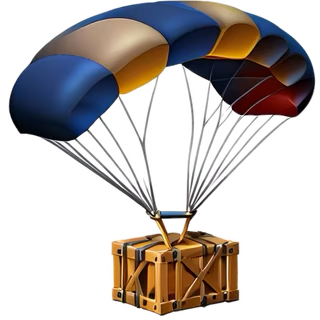

<div align="center">



# dropship.nvim

Your neovim tabs, dropshipped into your projects

</div>

## What it is

It's yet another bookmarks telescope plugin. However, I designed it so that you
can load your bookmarks from a lua file that isn't in your neovim config.

You can either:

- Load up a bookmark/drop-site for every open tab `:DropshipGlobalDir`
- Load up a bookmark/drop-site for the current tab `:DropshipCurrentTab`
- Load up a bookmark/drop-site in a new tab `:DropshipNewTab`

The whole plugin is under 100 lines of code so don't worry about bloating your
neovim config ;)

## Configuration

Below you may find some example [Lazy][2] configurations for this
plugin.

**Using a pre-baked list of drop-locations**:

```lua
{
  "ChausseBenjamin/dropship.nvim",
  dependencies = "nvim-telescope/telescope.nvim",
  opts = {
    new_tab_explorer = false, -- Set to true to use `:Exp` on new tabs
    -- prompt_title = "Prompt inside Telescope" -- Optional
    -- prompt_icon = "> " -- Optional: good if you don't have a NerdFont
    drop_locations = {
        { name = "Projects",      dir = "~/Workspace" },
        { name = "Neovim Config", dir = "~/.config/nvim" },
        { name = "University",    dir = "~/Documents/school/university" },
    },
  },
  keys = {
    {
      "<leader>dt",
      function() -- creates a new tab, then uses `:tcd`
        require("dropship").new_tab()
      end,
      mode = "n",
      desc = "[D]ropship in a new [T]ab",
    },
    {
      "<leader>dh",
      function() -- uses `:tcd` on current tab
        require("dropship").current_tab()
      end,
      mode = "n",
      desc = "[D]ropship right [H]ere",
    },
    {
      "<leader>dg",
      function() -- uses `:cd`
        require("dropship").globally()
      end,
      mode = "n",
      desc = "[D]ropship [G]lobally",
    },
  },
  cmd = {
    "DropshipCurrentTab",
    "DropshipNewTab",
    "DropshipGlobalDir",
  }
}
```


**Using a lua file for drop-locations**:

In order to have a single source of truth for my shortcuts, I have a script
that generates shortcuts for most of my apps [in my dotfiles][1]. This type of
solution makes sense for me to keep all my shortcuts in sync.

```lua
{
  "ChausseBenjamin/dropship.nvim",
  dependencies = "nvim-telescope/telescope.nvim",
  opts = {
  drop_locations = "~/.cache/droplist.lua"
  },
  -- Same as above for the rest...
}
```

And the `droplist.lua` would then look like the following:

```lua
return {
  { "Projects", "~/Workspace" },
  { "Neovim Config", "~/.config/nvim" },
  { "University", "~/Documents/school/university/current_semester" },
}
```

## Why did I make this

I've never written a neovim before. So I figured this would be a great learning experience.
Also, like mentionned above, I use a shortcuts generator script on my machines. Thus, being
able to import a lua file containing my shortcuts from outside my neovim directory is really
useful to me.


[1]: https://github.com/ChausseBenjamin/dotfiles/blob/master/.local/bin/shortcutgen
[2]: https://github.com/folke/lazy.nvim
